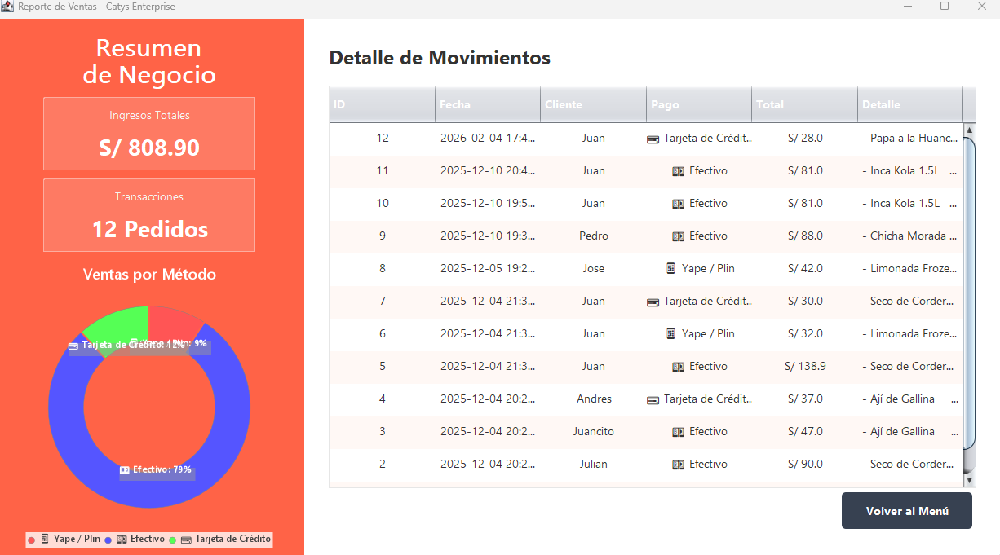
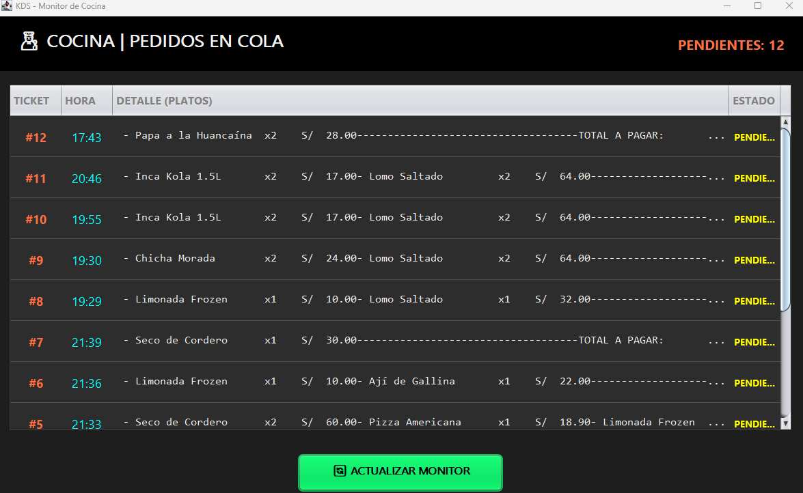
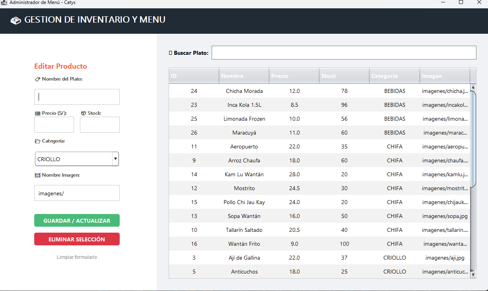
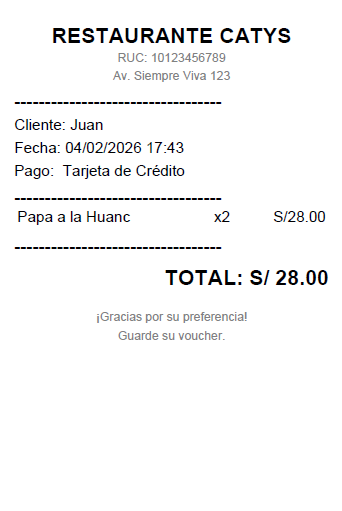
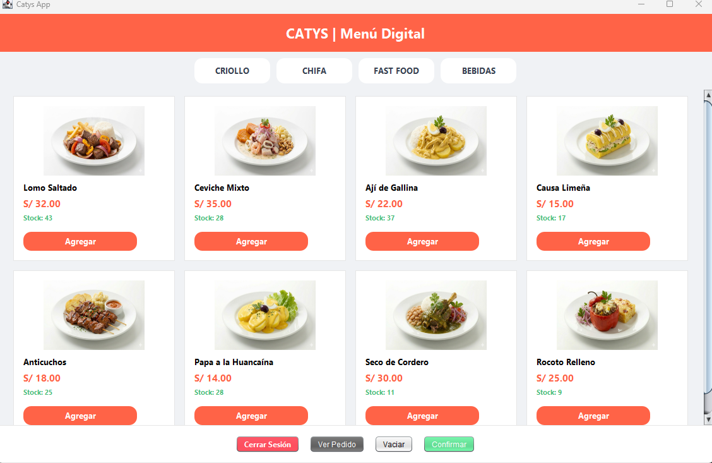

#Tienda Catys - Sistema ERP & POS Gastronómico Integral

Este proyecto es una solución **Enterprise Resource Planning (ERP)** y **Punto de Venta (POS)** de escritorio, desarrollada en **Java (Swing)** y **SQL Server**. Está diseñado para gestionar el flujo completo de un restaurante: desde la administración de inventarios y clientes hasta el monitoreo de pedidos en cocina y analítica financiera avanzada.

## Módulos y Funcionalidades

### 1. Dashboard de Analítica de Negocio
Visualización estratégica de datos para la toma de decisiones:
* **Ingresos Totales:** Resumen financiero en soles (S/) calculado en tiempo real.
* **Métricas de Operación:** Contador de pedidos totales procesados.
* **Gráfico de Ventas:** Visualización de métodos de pago (Efectivo, Tarjeta, Yape/Plin) mediante un gráfico estadístico tipo dona.
* **Historial de Movimientos:** Registro pormenorizado de transacciones con filtros por cliente y fecha.

### 2.  Monitor de Cocina (KDS)
Sistema de visualización en tiempo real para el área de preparación (Kitchen Display System):
* **Gestión de Comandas:** Visualización de tickets con detalle de platos y hora de pedido.
* **Control de Cola:** Indicador dinámico de órdenes pendientes para optimizar tiempos de entrega.

### 3. Gestión de Inventario y Menú
Control centralizado de la oferta gastronómica:
* **Mantenimiento de Productos:** Formulario dinámico para editar nombres, precios, stock y categorías.
* **Categorización Inteligente:** Organización por familias (CRIOLLO, CHIFA, FAST FOOD, BEBIDAS).
* **Catálogo Visual:** Asociación de imágenes a cada producto para la interfaz de ventas.

### 4. Proceso de Venta y Experiencia de Usuario
Flujo optimizado para el cliente y el cajero:
* **Personalización:** Selección de nombre de cliente y método de pago al iniciar el pedido.
* **Carrito Interactivo:** Adición de productos con validación de stock y cálculo automático de totales e IGV.
* **Facturación Digital:** Generación automática de comprobantes profesionales en formato **PDF** tras cada venta.

### 5. Seguridad y Mantenimiento de Clientes
* **Autenticación con BCrypt:** Hashing de contraseñas de seguridad bancaria para usuarios del sistema.
* **Validaciones Regex:** Control de calidad de datos para DNI (8 dígitos) y Teléfonos (9 dígitos).
* **Buscador Dinámico:** Filtro en tiempo real para localización de clientes en la base de datos.

## Stack Tecnológico

* **Lenguaje:** Java 17+.
* **Interfaz Gráfica:** Java Swing (Custom UI & Graphics2D).
* **Base de Datos:** Microsoft SQL Server (conectado vía `mssql-jdbc-12.6.1`).
* **Seguridad:** `jBCrypt-0.4` para el hashing de contraseñas de seguridad bancaria.
* **Reportes PDF:** `iTextPDF-5.5.13` para la generación de facturación digital.
* **Gráficos Estadísticos:** `JFreeChart-1.5.3` para el Dashboard de analítica en tiempo real.
* **Logging:** `SLF4J` para el control y registro de eventos del sistema.
* **Persistencia:** Patrones **DAO (Data Access Object)** y **Singleton** para una gestión eficiente de datos.

## 📸 Evidencia del Sistema

### Analítica de Negocio

### Monitor de Cocina (KDS)

### Gestión de Menú e Inventario

### Comprobante de Pago (PDF)

### Tienda vIrtual

## Configuración del Proyecto

1. **Base de Datos:** Ejecutar el script SQL incluido para crear las tablas en `CatysDB`.
2. **Conexión:** Ajustar credenciales de SQL Server en `ConexionSQL.java`.
3. **Librerías:** Incluir los archivos `.jar` de BCrypt, SQL Connector e iText/Jasper en el Classpath.

---
**Desarrollado por Juan José Parra Terrel** *Estudiante de Ingeniería de Sistemas - 6to Ciclo @ **UTP***
