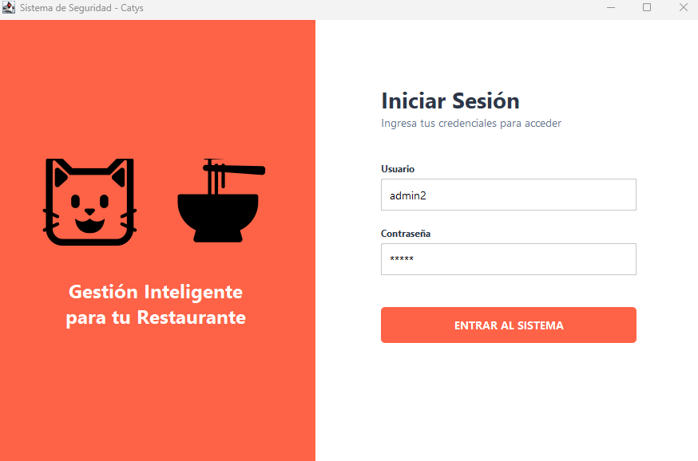
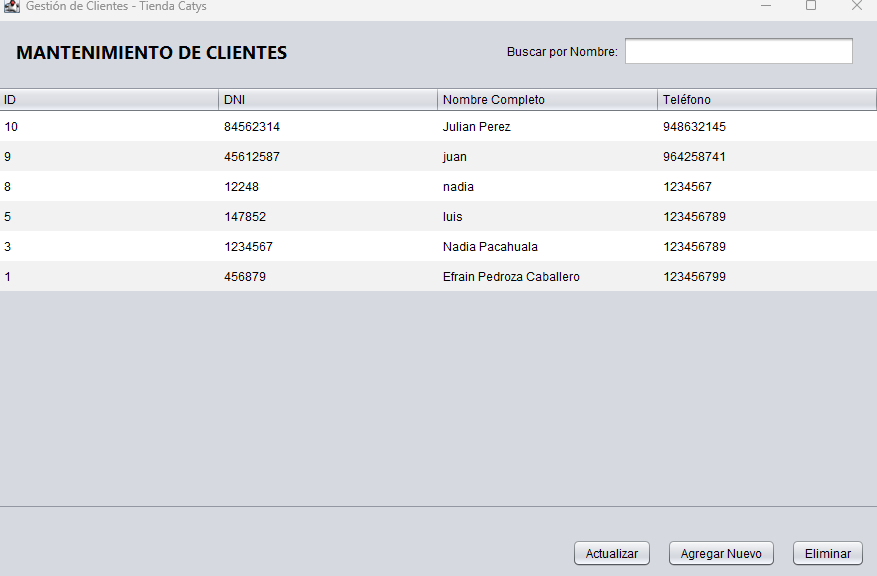
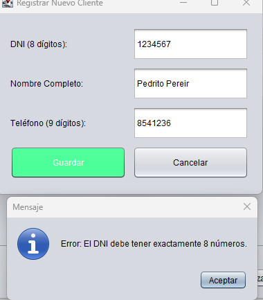

# Tienda Catys - Sistema de Gestión de Ventas

Este es un sistema de escritorio desarrollado en **Java (Swing)** y **SQL Server**, diseñado para gestionar clientes y usuarios de manera eficiente y segura. El proyecto aplica patrones de diseño y estándares de seguridad de la industria.

## Características Principales

* **Autenticación Segura:** Implementación de **BCrypt** para el hashing de contraseñas, evitando el almacenamiento en texto plano.
* **Gestión de Clientes (CRUD):** Listado, registro y eliminación de clientes con actualización en tiempo real.
* **Buscador Dinámico:** Filtro de búsqueda en tiempo real mediante `TableRowSorter`.
* **Validaciones Robustas:** Uso de **Expresiones Regulares (Regex)** para asegurar la integridad de datos (DNI, Teléfono, Nombres).
* **Arquitectura Profesional:** Uso del patrón **DAO (Data Access Object)** y **Singleton** para la gestión de la conexión a la base de datos.

## Tecnologías Utilizadas

* **Lenguaje:** Java 17+
* **Base de Datos:** SQL Server
* **Librerías:** * `jBCrypt` (Seguridad)
    * `JDBC` (Conectividad SQL)
* **IDE:** Visual Studio Code / NetBeans

## Capturas de Pantalla

### Login Seguro (BCrypt)

*El sistema valida credenciales comparando hashes seguros.*

### Mantenimiento de Clientes

*Interfaz moderna con scroll funcional y buscador en tiempo real.*

### Registro con Validaciones

*Control de calidad de datos mediante Regex.*

## Configuración del Proyecto

1. **Base de Datos:**
   - Ejecuta el script SQL incluido para crear la base de datos `CatysDB`.
   - Asegúrate de que la columna `password` de la tabla `Usuarios` sea `VARCHAR(100)`.

2. **Conexión:**
   - Ajusta las credenciales en la clase `ConexionSQL.java`.

3. **Librerías:**
   - Asegúrate de incluir el `.jar` de `jBCrypt` en el classpath.

---
Desarrollado por Juan Parra - Estudiante de Ingeniería de Sistemas @ UTP
